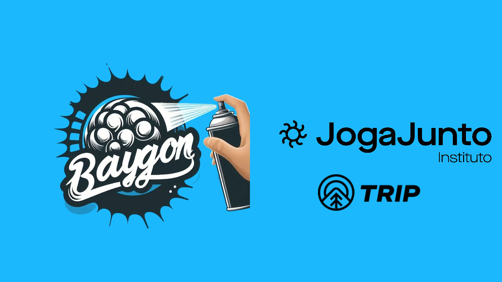

# Py_Baygon_Auth

> Esse repositório foi feito para guardar o projeto Final do Módulo de Python do squad **Baygon Quality** formado pela ONG do Instituto Joga Junto. O case consistia fazer em python: 
- Criar usuário no endpoint repassado;
- Realizar Login com o usuário criado;
- Salvar no JSON a resposta.

### Melhorias usadas

O projeto está finalizado e as próximas atualizações serão voltadas nas seguintes tarefas:
> Váriaveis de Ambiente
- Uso do 'pip freeze > requirements.txt' para baixar todas as depedências da ENV;
- Uso do dotenv para uso variáveis de ambiente locais no computador.

> Geração de Dados Aleatórios
- Uso da biblioteca FAKER para criar o usuário aleatório;
- Uso do método .split para separar a string de endereço criada pela biblioteca faker ao encontrar uma quebra de linha (\n);
- Uso do método .join para unir a string separada utilizando hífen (-).

> Salvamento do arquivo JSON
- "Ident 4" para o JSON não salvar em uma só linha.

> Tratamento de exceções
- Com o bloco Try e Except correspondente ao erro tratado:
- - HTTP: requests.exceptions.HTTPError
- - Ao salvar o JSON: De entrada e saída (IOError), provavelmente por falta de memória no seu dispositivo. 

> 

### Correções posteriores e comentários

Deixando esse campo aberto para se houver alguma melhoria no código pós apresentação.

## 💻 Pré-requisitos

EM CONSTRUÇÃO...

## 🤝 Squad Baygon

Agradecemos imensamente as pessoas que fizeram esse projeto acontecer: o nosso querido **Squad Baygon Quality** e ao Instituto Joga Junto pela oportunidade.

<table>
  <tr>
    <td align="center">
      <a href="https://github.com/anniellecrispim" title="GitHub da Annielle">
         
        
          <b>Annielle Crispim</b>
        
      </a>
    </td>
    <td align="center">
      <a href="https://github.com/caiobarreto0" title="GitHub do Caio">
         
        
          <b>Caio Barreto</b>
        
      </a>
    </td>
     <td align="center">
      <a href="https://github.com/juliarobaina" title="GitHub da Julia">
         
        
          <b>Julia Robaina</b>
        
      </a>
    </td>
    <td align="center">
      <a href="https://github.com/Vitor-Back" title="GitHub do Vitor">
         
        
          <b>Vitor Back</b>
        
      </a>
    </td>
    <td align="center">
      <a href="https://github.com/tamiresana" title="GitHub da Tamires">
         
        
          <b>Tamires Ana</b>
        
      </a>
    </td>
  </tr>
</table>

## 😄 Sobre o Instituto 

O Instituto Joga Junto é uma organização que promove oportunidades de desenvolvimento por meio da educação e formação profissional. Eles oferecem tutoria gratuita no modo 'estudo aberto', com turmas selecionadas e pequenas,  focando no treinamento em áreas de tecnologia, com o objetivo de capacitar pessoas e abrir novas perspectivas de carreira. O Instituto também se dedica a projetos sociais que buscam transformar vidas através do conhecimento e da inclusão social. E o mais importante: **Jogar Junto!**

### Trilha Tripp 

Além de estamos na trilha de capacitação de QA (Quality Assurance), estamos no módulo avançado com direito a treinameto com Python e testes automatizados. Além de testes de API.

### Colaboradores IJJ

Gostariamos de agradecer a essa turma que nos deu oportunidade e fez parte da nossa história no Instituto!

#### Pessoal do GitHub
<table>
  <tr>
    <td align="center">
      <a href="https://github.com/MatheusGeambastiane" title="Foto do Matheus">
         
        
          <b>Matheus Geambastiane</b>
        
      </a>
    </td>
    <td align="center">
      <a href="https://github.com/MihBarreto" title="GitHub da Michelle">
         
        
          <b>Michelle Barreto</b>
        
      </a>
    </td>
  <td align="center">
      <a href="https://github.com/ryanoliveiragit" title="GitHub do Ryan">
         
        
          <b>Ryan Oliveira</b>
        
      </a>
    </td>
<table>

#### Pessoal do Linkedln

<table>
  <tr>
   <td align="center">
      <a href="https://www.linkedin.com/in/andrealua/" title="Perfil da Andrea Lua Di Sarno no LinkedIn">
       
     
       <b>Andrea Lua Di Sarno</b>
     
   </a>
 </td>
 <td align="center">
      <a href="https://www.linkedin.com/in/ivansilvati/
    " title="Perfil do Ivan Silvati no LinkedIn">
       
     
       <b>Ivan Silvati</b>
     
   </a>
 </td>
 <td align="center">
      <a href="https://www.linkedin.com/in/j%C3%A9ssica-nunes16/" title="Perfil da Jessica no LinkedIn">
       
     
       <b>Jessica Nunes</b>
     
   </a>
 </td>
 <td align="center">
      <a href="https://www.linkedin.com/in/vanessa-silva-8561b320b/" title="Perfil da Vanessa Silva no LinkedIn">
       
     
       <b>Vanessa Silva</b>
     
   </a>
 </td>
 <td align="center">
      <a href="https://www.linkedin.com/in/viviane-araujo-748047191/" title="Perfil da Viviane Araujo no LinkedIn">
       
     
       <b>Viviane Araujo</b>
     
   </a>
 </td>
 <td align="center">
      <a href="https://www.linkedin.com/in/vivienzilberman/" title="Perfil da Vivien Zilberman no LinkedIn">
       
     
       <b>Vivien Zilberman</b>
     
   </a>
 </td>
 <td align="center">
      <a href="https://www.linkedin.com/in/luizaaleixo/" title="Perfil da Maria no LinkedIn">
       
     
       <b>Maria Luiza Aleixo</b>
     
   </a>
 </td>
 <td align="center">
      <a href="https://www.linkedin.com/in/rfdsouza/" title="Perfil do Trem Desgovernado no LinkedIn">
       
     
       <b>Renato Souza</b>
     
   </a>
 </td>
<table>

### 📝 Licença

Esse projeto está sob licença. Veja o arquivo [LICENÇA](LICENSE) para mais detalhes.
